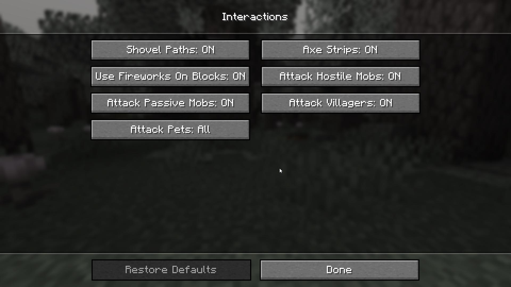
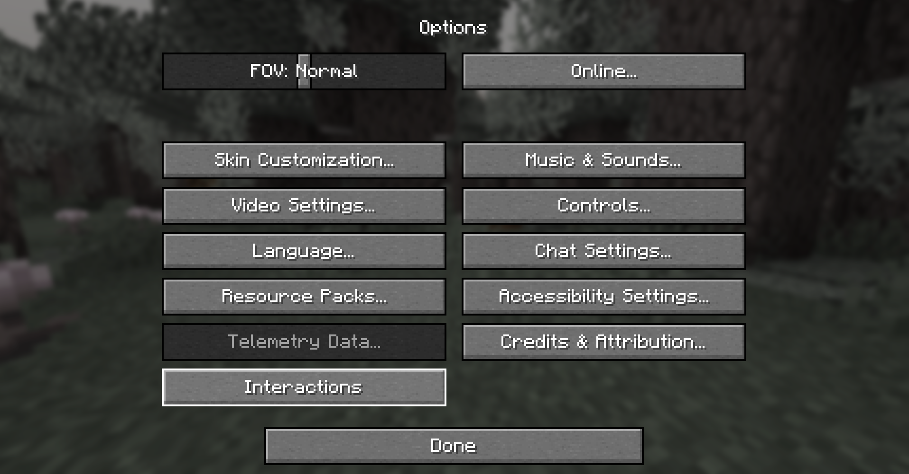

# Interaction Manager

Interaction Manager is a client side mod allowing you to toggle certain block and mob interactions. By default, vanilla behaviour is preserved.

### Simply Enable or Disable
- Shovels creating paths
- Axes stripping blocks
- Fireworks working on blocks
- Attacking hostile mobs
- Attacking passive mobs
- Attacking villagers 

It also gives you the option to stop the player from attacking your pets, others' pets or all tamable mobs.

If Mod Menu isn't installed these options are easily accessible in the in game 'Interactions' menu. As shown above.
To access them go to `Options`>`Interactions`

If Mod Menu is installed by default the `Interactions` button is hidden. And the settings can be changed using Mod Menu.
To show the `Interacions` button if Mod Menu is installed see the [Config Section](#config).

Show Image

### Config

 Expand Configuration Information 

#### If you don't intend to change more advanced options feel free to skip this section.
**Options related to player behaviour (block and mob interactions) are accessible in the in game options menu.**

The configuration file allows for more fine-tuning and isn't necessary to edit.
It's located in `config/interactionmanager.json`.
It's stored in JSON, which is easy to read and modify.

### Options only available in the config file
1. `should_add_interactions_button` - The mod settings can be opened using Mod Menu, as such this option controls if the button should be added.
   - `always` - Always show the `Interactions` button.
   - *default* `only_if_mod_menu_is_not_installed` - Hide the `Interactions` button if mod menu is installed.
   - `never` - Hide the `Interactions` button.

### Suggestions and Issues
If you have any **suggestions** or run into some **issues** please create a new ticket on the **[Issue Tracker](https://github.com/bejker123/InteractionManager/issues)**.

### Open source
This mod's code is **free to view and modify**, publicly available on **[GitHub](https://github.com/bejker123/InteractionManager)**.
